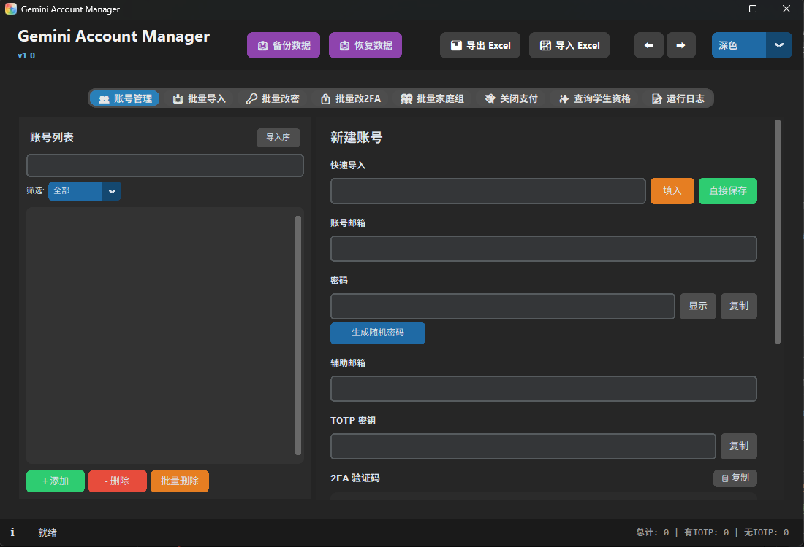
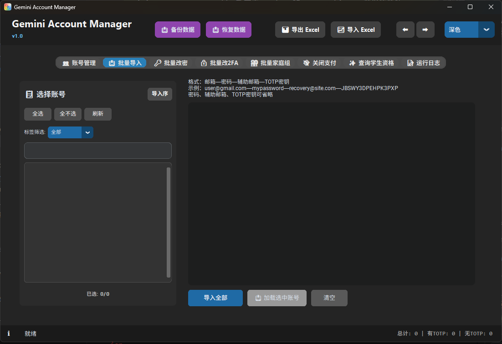
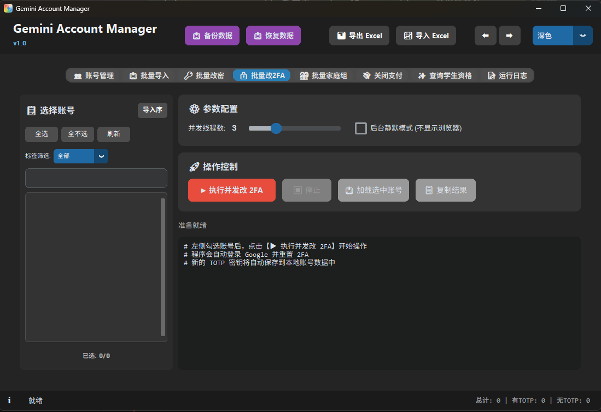
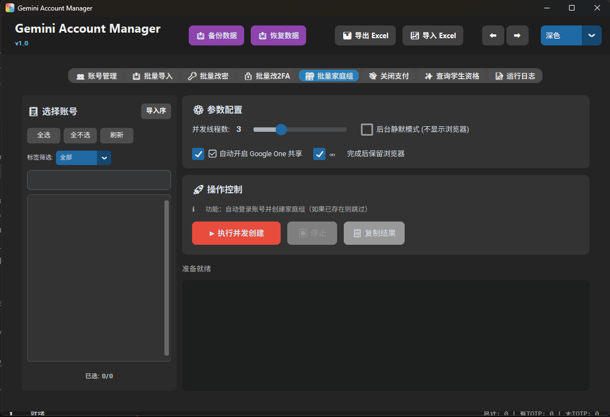
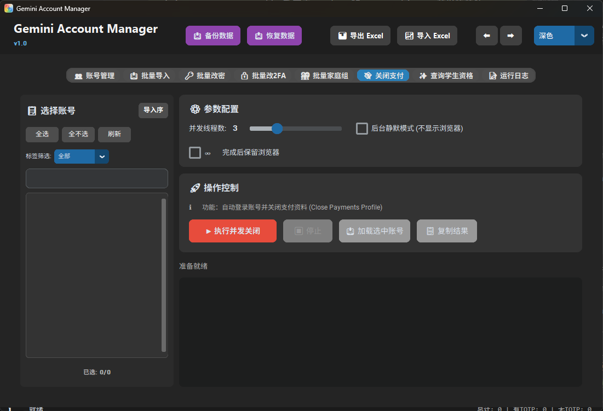
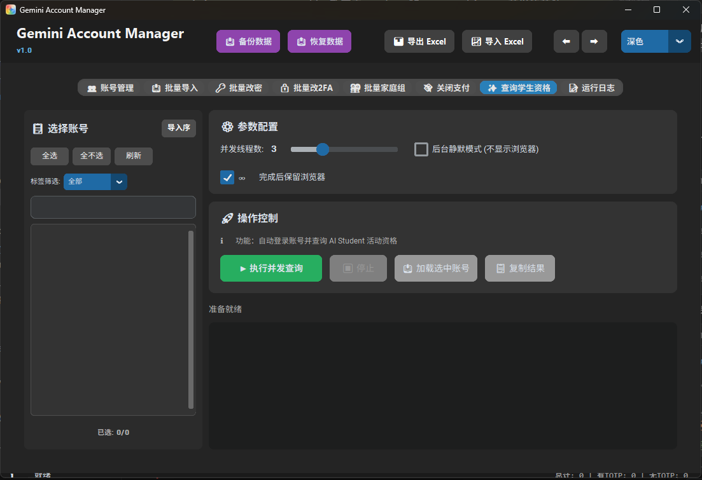

# Gemini Account Manager

Gemini Account Manager 是一款基于 Python 和 CustomTkinter 开发的开源 Google 账号本地化管理与自动化运维工具。它主要为需要管理大量 Google 账号（特别是用于 Gemini AI、Google One 等业务的账号）的用户提供一套**现代化、可视化、高并发**的解决方案。

## 🌟 核心功能

- **📦 本地化账号管理**
  - **可视化列表 & 多选操作**：支持按邮箱A-Z排序、导入时间排序。完美支持 `Ctrl` 和 `Shift` 键进行账号的多选/连选撤销，并附带一键批量删除选中账号的功能。
  - **标签分类系统**：支持为账号打上 `家庭组`、`成品号`、`资格号` 等 Emoji 标签，在列表中直观展示并支持组合筛选。
  - **快速导入与导出**：支持 `邮箱----密码----辅助邮箱----TOTP密钥` 的标准格式实现文本批量导入；支持通过 Excel 进行双向导入导出。
  - **TOTP 验证码生成**：内置 TOTP 引擎，选中账号即可秒级生成最新的 6 位 2FA 动态验证码，带倒计时进度条。
- **⚡ 多线程并发运维** (使用隐身/无痕模式浏览器)
  - **底层完全无痕化**：所有基于 `DrissionPage` 的自动化任务现在均默认在 Chromium 的**无痕模式 (Incognito)** 下运行，最大限度防止账号历史数据串流和提高安全性。
  - **批量查询 AI Student 资格 (智能提取)**：内置正则表达式与多层 DOM 树回退策略，0 秒内从 Google Promo 页面提取并打印真正的 "**Verify eligibility**" (SheerID 验证网址) 或直接反馈账号是否满足条件。
  - **密码及验证自动化**：并发登录多号自动修改密码，自动设置两步验证并抓取保存 Base32 密钥。
  - **批量关闭支付资料 / 创建家庭组**：全自动执行对应网页的标准化流程。家庭组功能同时可作为**批量快速登录验证工具**——已创建家庭组的账号会被秒级识别并跳过，方便快速确认账号登录状态。
- **💻 沉浸式 UI 体验**
  - 采用 **CustomTkinter** 框架构建，支持浅色/深色主题动态无缝切换，已规避底层透明渲染 Bug。
  - 优化设计的响应式双切分布局：账号列表与右侧详情/工作台之间**支持鼠标自由拖拽分隔条**。
  - **智能账号选择面板**：各个批量执行工具（导入、改密等）自带基于 Emoji 标签筛选的可视化账号选择抽屉。

## 📥 下载使用

### 方式一：直接下载（推荐普通用户）
前往 [Releases](https://github.com/Kyle1st/Gemini-Account-Manager/releases) 页面，下载最新版本的 **`GeminiAccountManager_v1.0_Windows.zip`**。

解压后双击 `GeminiAccountManager.exe` 即可运行，**无需安装 Python 环境**。

### 方式二：从源码运行（开发者）
项目依赖于 Python 3.10+ 环境：
```bash
git clone https://github.com/Kyle1st/Gemini-Account-Manager.git
cd Gemini-Account-Manager

# 建议使用虚拟环境
pip install -r requirements.txt
python main.py
```
> **注意**：首次运行并发任务时，`DrissionPage` 可能会自动下载 Chromium 内核以支持浏览器自动化。

### 从源码打包
如需自行打包为可执行程序：
```bash
pip install pyinstaller
.\build.bat
```
打包产物输出至 `dist\GeminiAccountManager\` 目录。

## 📂 项目结构

| 文件/目录 | 描述 |
| :--- | :--- |
| `main.py` | 程序启动入口 |
| `ui_main.py` | 主要窗口结构构建及全局外观配置 |
| `account_manager.py` | 本地核心数据模型，负责 `accounts_data.json` 的读写与标签系统 |
| `google_pw_changer.py` | 核心浏览器自动化逻辑类，封装了登录、换密码、查资格等并发任务的核心页面操作逻辑 |
| `totp_engine.py` | TOTP 二维码算法引擎实现 |
| `tab_*.py` | 各大主功能 Tab 的 UI 层面板（账号管理、批量导入、改密、关闭支付等） |
| `ui_*.py` | 抽离的复用型 UI 组件层（如左侧拖拽列表、选择器面板、密码生成窗等） |

## ⚠️ 隐私数据与开源使用规范

本项目**完全在本地运行**，没有任何后端服务器上传逻辑。所有的账号数据将明文保存在项目根目录生成的 `accounts_data.json` 文件中。

如果你打算下载使用或基于此项目二次开发，请务必注意：
1. **千万不要将包含你真实账号的 `accounts_data.json` 提交到公开的 GitHub 仓库**。
2. 我们已经默认在 `.gitignore` 中忽略该文件，但请在每次 `git commit` 前 `git status` 仔细检查。
3. 如果录制运行演示视频，请对左侧邮箱列表及生成的密码、TOTP 等核心信息进行打码处理。

## 🤝 贡献指南

欢迎提交 Pull Requests 来优化这个项目！你可以从以下几个方向进行贡献：
- 识别并增加更多自动化检测场景 (如自动过 Google Voice 等)
- 优化 `DrissionPage` 在极慢网络或特殊验证码风控环境下的异常重试策略
- UI 交互级的进一步现代化改版

## 📜 许可协议

This project is licensed under the MIT License - see the [LICENSE](LICENSE) file for details.

## 📸 界面预览

### 账号管理


### 批量导入


### 批量改密


### 批量改 2FA


### 批量家庭组


### 关闭支付资料


### 查询学生资格

